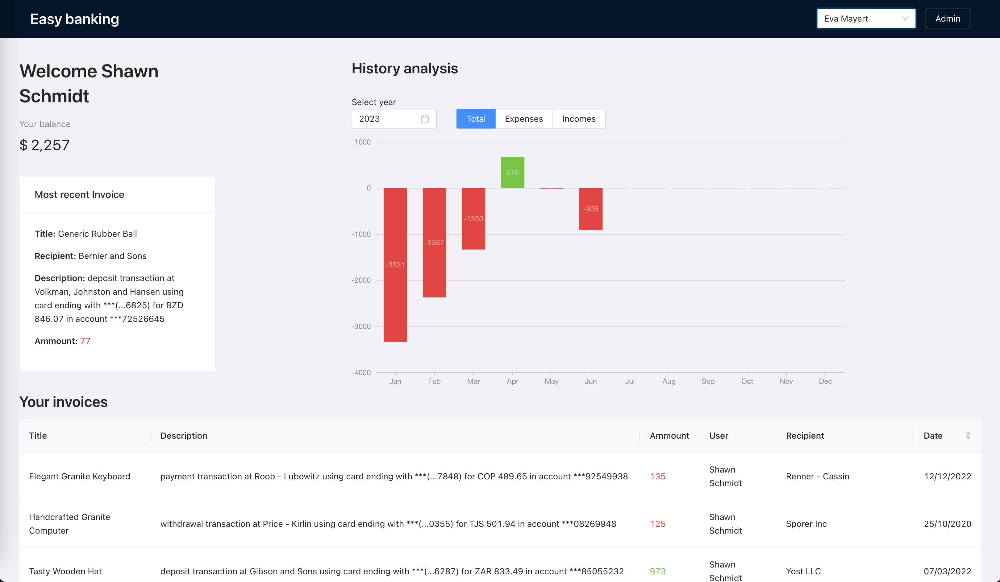

# Easy Banking

This simple app is a banking simulator. You can create new users, access them (via dropdown), and manage transactions and invoices on behalf of users (from admin view).

It's main purpose was to polish node.js and sql skills.

## Technologies

- react + typescript
- express + node.js + typescript
- postgresql

TODO:

- [ ] add more exhaustive readme (with gif showcase)
- [ ] dockerize app
